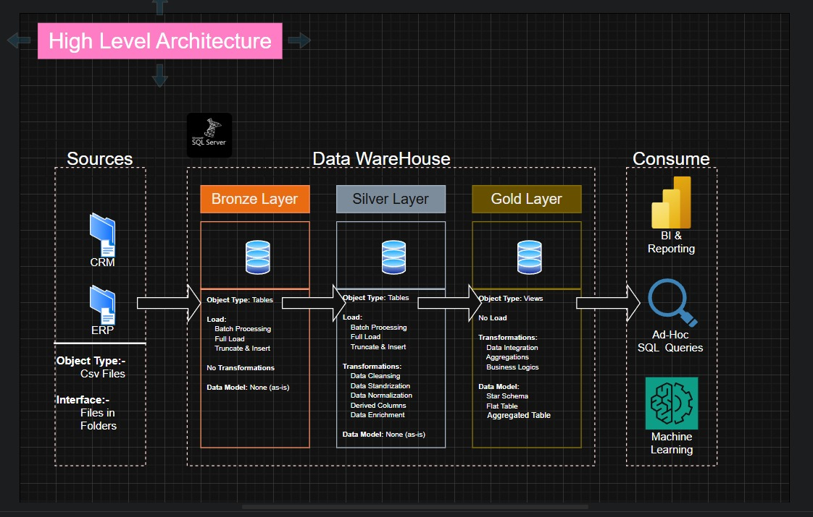

# Data Warehouse and Analytics Project

Welcome to the **Data Warehouse and Analytics Project** repository.  
This project demonstrates a complete data warehousing and analytics solution, starting from building the data warehouse to creating meaningful insights. It is designed as a portfolio project to show practical skills in data engineering and analytics.

---

## Data Architecture

The data architecture is based on the Medallion Architecture with three layers: **Bronze**, **Silver**, and **Gold**.  

1. **Bronze Layer**: Stores raw data directly from the source systems. Data is loaded from CSV files into SQL Server.  
2. **Silver Layer**: Cleans, standardizes, and prepares the data for further use.  
3. **Gold Layer**: Contains business-ready data organized in a star schema for reporting and analytics.  

---

## Project Overview

This project includes:

1. **Data Architecture**: Designing a data warehouse using the Medallion approach.  
2. **ETL Pipelines**: Extracting, transforming, and loading data into the warehouse.  
3. **Data Modeling**: Building fact and dimension tables for analysis.  
4. **Analytics & Reporting**: Creating SQL-based reports and dashboards for insights.  

This project is useful for anyone interested in:  
- SQL development  
- Data engineering  
- ETL pipeline design  
- Data modeling  
- Analytics and reporting  

---

## Tools and Resources

- **[Datasets](datasets/):** Sample CSV files used in the project.  
- **[SQL Server Express](https://www.microsoft.com/en-us/sql-server/sql-server-downloads):** Lightweight SQL Server edition.  
- **[SQL Server Management Studio (SSMS)](https://learn.microsoft.com/en-us/sql/ssms/download-sql-server-management-studio-ssms?view=sql-server-ver16):** Tool for managing SQL databases.  
- **[GitHub](https://github.com/):** Version control and project hosting.  
- **[DrawIO](https://www.drawio.com/):** For diagrams and architecture design.  
- **[Notion](https://www.notion.com/):** For project management and documentation.  
- **[Notion Project Steps](https://thankful-pangolin-2ca.notion.site/SQL-Data-Warehouse-Project-16ed041640ef80489667cfe2f380b269?pvs=4):** All project phases and tasks.  

---

## Project Requirements

### Building the Data Warehouse (Data Engineering)

**Objective**  
Create a SQL Server–based data warehouse to integrate sales data for reporting and decision-making.  

**Specifications**  
- Import data from ERP and CRM (CSV files).  
- Clean and fix data issues before analysis.  
- Combine both data sources into one model.  
- Only the latest dataset is used (no history required).  
- Provide clear documentation of the data model.  

---

### Analytics & Reporting (Data Analysis)

**Objective**  
Use SQL queries to provide insights into:  
- Customer behavior  
- Product performance  
- Sales trends  

These insights help stakeholders make better business decisions.  
 

---

## Repository Structure

│
├── datasets/ # ERP and CRM datasets
│
├── scripts/ # SQL ETL scripts
│ ├── bronze/ # Raw data loading
│ ├── silver/ # Data cleaning and transformation
│ ├── gold/ # Analytical models
│
├── tests/ # Test and validation scripts
│
├── README.md # Project overview
├── LICENSE # License details
├── .gitignore # Ignored files for Git
└── requirements.txt # Project dependencies

---

## License

This project is licensed under the [MIT License](LICENSE). You can use, modify, and share it with proper credit.  

---

## About Me

**Lakshya Gupta**
